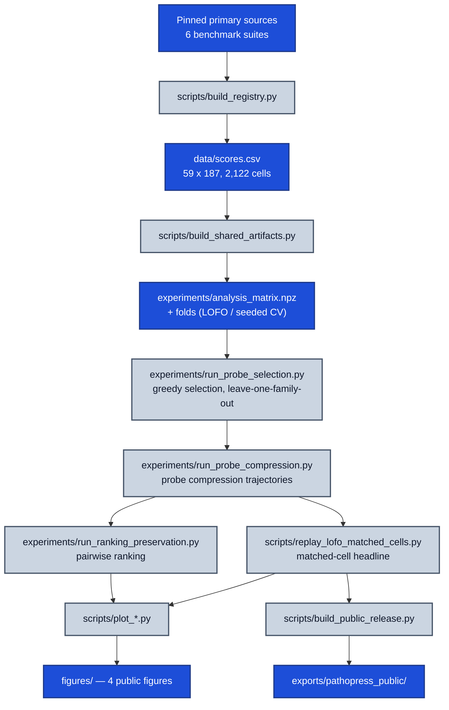

<h1 align="center">PathoPress</h1>

<p align="center">
  <b>Do published pathology-benchmark scores predict the unpublished ones — and how few evaluations are worth running on a new model?</b>
</p>

<p align="center">
  <a href="https://github.com/RyanKim17920/pathopress/actions/workflows/ci.yml"></a>
  <a href="LICENSE"></a>
</p>

<p align="center">
  <a href="docs/scope-and-claims.md">Scope &amp; claims</a> &nbsp;·&nbsp;
  <a href="docs/benchpress-parity.md">Parity notes</a> &nbsp;·&nbsp;
  <a href="figures/README.md">Figures</a> &nbsp;·&nbsp;
  <a href="experiments/README.md">Experiments</a> &nbsp;·&nbsp;
  <a href="LICENSE">License</a>
</p>

Most pathology foundation models never run on most pathology evaluations, so the score matrix is mostly holes. PathoPress is a port of [Microsoft BenchPress](https://github.com/microsoft/benchpress) to a 59-model × 187-evaluation pathology score matrix, and it asks which few evaluations are worth running on a new model.

**Headline.** Revealing **4 probe evaluations** cuts median absolute error from **2.6524** (no probes) to **1.8781** normalized points, beating a random probe control in **22 of 34** leave-one-family-out folds (p = 0.0151) and the no-probe baseline in **18 of 34** (p = 0.0088). The direction is solid; the magnitude is not precisely estimable — see [scope & claims](docs/scope-and-claims.md).

<p align="center">
  
</p>

## Installation

```bash
git clone <this-repo> && cd pathopress
uv pip install -e .          # or: python3 -m pip install -e .
```

## Usage

Audit the registry and predict an unobserved cell:

```bash
pathopress audit --scores data/scores.csv
pathopress predict --model atlas \
  --evaluation eva.leaderboard.bach.validation --confidence
```

Reproduce the headline numbers offline. This needs **no GPU and runs no benchmarks** — it rebuilds the matrix from `data/scores.csv`, replays the LOFO matched-cell comparison, and writes `experiments/lofo_matched_cells_rank1.json`:

```bash
pathopress-replay
```

Other console scripts:

```bash
pathopress-run --list                  # list reproducible workflow steps
pathopress-run build-shared-artifacts
pathopress-check-freshness
pathopress-build-release
pathopress-download-release BASE_URL DESTINATION
```

Two caveats before you go further:

- The full selection and compression sweeps are multi-hour jobs — read [experiments/README.md](experiments/README.md) first.
- Everything above runs on the checked-in `data/scores.csv`. Rebuilding *that* file needs the eight pinned upstream checkouts in `data/provenance.json` (`scripts/fetch_sources.py`, then `scripts/build_registry.py`), also documented in [experiments/README.md](experiments/README.md).

## Method

The score matrix is 59 pathology foundation models × 187 evaluation protocols across 6 benchmark suites, with 2,122 observed cells — **19.2% density**. A rank-1 bias-decomposed ALS completion (parity-verified against the pinned BenchPress primitive to ~1e-13) is fit to the observed history. For a new model you run a small probe set, and the fit completes the rest of its row. Which columns to reveal is chosen greedily on the training models of each fold, never on the model being predicted.



## Results

| Claim | Number | Protocol |
|---|---|---|
| Probe utility (headline) | MedAE **1.8781** at k=4 vs **2.6524** at k=0, random control **2.6013** | LOFO, 34 family folds, matched cells |
| Paired-fold significance | 18/34 vs k=0 (p = 0.0088); 22/34 vs random (p = 0.0151) | Wilcoxon signed-rank over folds |
| Effect size | 29.2% point estimate, 95% CI **[2.8%, 58.7%]** | bootstrap over folds |
| Ranking preservation | **0.679** greedy vs **0.552** random | all 17,159 model pairs, margin 0 |
| Per-evaluation utility | **86 / 174 = 49.4%**, CI [42.0%, 56.9%] | per-column matched-cell, leave-one-out |

Conventions behind row 1 and row 2, which differ and are not interchangeable:

- The MedAE numbers are medians of 34 fold medians. The random control **2.6013** is **convention A** (median over all 340 fold × repeat MedAEs); it is **2.6260** under **convention B** (median of fold medians).
- The random significance test in row 2 uses **convention B** fold medians, not the convention-A value in row 1.

<p align="center">
  
</p>

## Limitations and scope

- **Per-evaluation utility is null.** Asked column by column — does revealing four probes improve prediction for *this particular* evaluation? — the answer is **86 / 174 = 49.4%**, indistinguishable from a coin flip. The matrix-wide gain is real; the per-evaluation gain is not established.
- **Cost inversion.** The most informative probes are the *heaviest* benchmarks — the top-ranked probe, `thunder.spider_skin.linear_probing`, covers 159,854 images — and restricting selection to a 25-task low-friction allowlist erases the effect (Wilcoxon p = 0.4939, bootstrap CI **[-11.5%, +20.7%]**, underpowered by design). "Run five cheap evaluations instead of 187" is not supported here, and better cost modeling cannot repair it: directly reported runtime, hardware, annotation-hour, or dollar cost exists for **0 of 187** evaluations.
- **Scale, sample size, and provenance.** Raw MedAE 1.609 vs BenchPress's 4.6 is *not* a three-fold win — pathology dispersion is roughly four times tighter, and the scale-corrected ratio is modestly *worse* than upstream. The 59 models collapse to 34 family groups, so nulls mean "not established", not "disproven". Scores are machine-parsed from pinned primary sources, not dual-human-verified.

Full treatment — conventions, the underpowered allowlist comparison, the optimistic selection objective, and the external BenchPress dependency — is in [docs/scope-and-claims.md](docs/scope-and-claims.md), with protocol distinctions against upstream in [docs/benchpress-parity.md](docs/benchpress-parity.md), cost evidence in [docs/evaluation-cost-evidence.md](docs/evaluation-cost-evidence.md), and source coverage in [docs/score-source-coverage.md](docs/score-source-coverage.md).

## Licensing

Code is [MIT-licensed](LICENSE), including the attributed BenchPress adaptations listed in [THIRD_PARTY_NOTICES.md](THIRD_PARTY_NOTICES.md).

Registry facts do not relicense benchmark data, publications, images, labels, or model weights — see [data/LICENSE](data/LICENSE) and [DATA_NOTICE.md](DATA_NOTICE.md).
