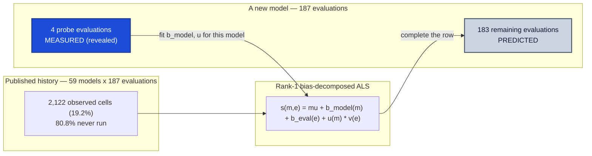
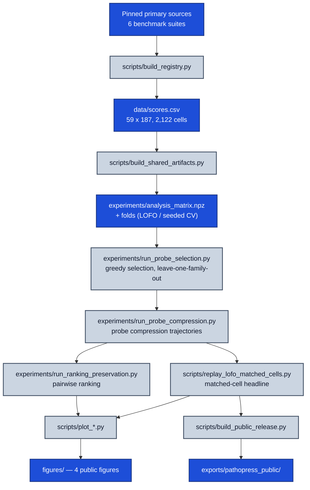

# PathoPress

<p align="center">
  <a href="LICENSE"></a>
  <a href="docs/scope-and-claims.md"></a>
</p>

**Most pathology foundation models are never run on most pathology evaluations.**
PathoPress asks whether the scores that *have* been published can predict the
ones that have not, and which handful of evaluations is worth running on a new
model. It is a port of [Microsoft BenchPress](https://github.com/microsoft/benchpress)
to a 59-model × 187-evaluation pathology score matrix.

The headline: under leave-one-family-out validation on matched cells, revealing
**4 probe evaluations** cuts median absolute error from **2.6524** (predict with
no probes) to **1.8781** normalized points. Greedy probe selection beats the
no-probe baseline in **18 of 34** family folds (Wilcoxon p = 0.0088) and a random
probe control in **22 of 34** (p = 0.0151). The effect is real; its *size* is
not pinned down — the bootstrap CI on the 29.2% point-estimate reduction runs
**[2.8%, 58.7%]**.

<p align="center">
  
</p>

## The method

The score matrix is 59 pathology foundation models × 187 evaluation protocols
across 6 benchmark suites, with 2,122 observed cells — **19.2% density**. A
rank-1 bias-decomposed ALS completion (parity-verified against the pinned
BenchPress primitive to ~1e-13) fits the observed history. For a new model you
run a small probe set; the fit completes the rest of its row.



Probe columns are revealed; the remainder is predicted. Which columns to reveal
is chosen greedily on the training models of each fold, never on the model being
predicted.

## Results

| Claim | Number | Protocol |
|---|---|---|
| Probe utility (headline) | MedAE **1.8781** at k=4 vs **2.6524** at k=0, random control **2.6013** | LOFO, 34 family folds, matched cells |
| Paired-fold significance | 18/34 vs k=0 (p = 0.0088); 22/34 vs random (p = 0.0151) | Wilcoxon signed-rank over folds |
| Effect size | 29.2% point estimate, 95% CI **[2.8%, 58.7%]** | bootstrap over folds |
| Ranking preservation | **0.679** greedy vs **0.552** random | all 17,159 model pairs, margin 0 |
| Per-evaluation utility | **86 / 174 = 49.4%**, CI [42.0%, 56.9%] | per-column matched-cell, leave-one-out |

The last row is a **null result**. Asked column by column — does revealing four
probes improve the prediction of *this particular* evaluation? — the answer is
indistinguishable from a coin flip. The matrix-wide gain is real; a
per-evaluation gain is not established.

<p align="center">
  
</p>

## The cost inversion

The most informative probes are the *heaviest* benchmarks. The top-ranked probe,
`thunder.spider_skin.linear_probing`, covers 159,854 images; `thunder.esca`
covers 367k and `thunder.tcga_uniform` 272k. Restricting selection to a 25-task
low-friction allowlist erases the effect entirely: greedy scores **2.0404**
against random's **2.0109** inside the allowlist — a null.

So the appealing version of this result — "run five cheap evaluations instead of
187" — is not supported here. And it cannot be repaired with better cost
modeling, because the cost audit found directly reported runtime, hardware,
annotation-hour, or dollar cost for **0 of 187** evaluations. Sample counts and
the feasibility allowlist are metadata proxies, not a cost curve.

## Scale correction

The raw cell-level MedAE is 1.609 against BenchPress's 4.6. That is **not** a
three-fold improvement. Pathology per-column dispersion is roughly four times
tighter than the upstream LLM matrix (median column SD **3.75** here vs **14.1**
upstream). On a scale-corrected error-to-dispersion basis the ratio is **0.43**
here versus **0.33** upstream — this port is modestly *worse* than upstream, not
better.

<p align="center">
  
</p>

## Limitations

- **Selection objective is optimistic.** The greedy objective scores revealed
  probe cells as literal 0.0, reading 1.5142 at four probes against a held-out
  1.7994 — about 15.9% optimistic. Correcting it changes which probes get picked
  and needs an ~8.7-hour rerun.
- **Held-out ranking is not estimable.** Under LOFO the hidden-only ranking
  measurement reaches `pairwise_n_pairs = 1`; no precise inference follows from it.
- **N = 59 is small.** The 59 models collapse to 34 independent family groups,
  with a median of 1 validation model per fold. The nulls above are "not
  established", not "disproven".
- Scores are machine-parsed from pinned primary sources, not dual-human-verified.
  Normalized points mix several native metrics and are not a clinical unit.
  Retrospective interpolation is not prospective clinical validation.

<p align="center">
  
</p>

## Quickstart

```bash
uv pip install -e .          # or: python3 -m pip install -e .

pathopress audit --scores data/scores.csv
pathopress predict --model atlas \
  --evaluation eva.leaderboard.bach.validation --confidence
```

Reproduce the corrected headline numbers offline — no GPU, no benchmark runs:

```bash
pathopress-replay
```

It rebuilds the matrix from `data/scores.csv`, replays the LOFO matched-cell
comparison, and writes `experiments/lofo_matched_cells_rank1.json`. It needs
three inputs, all checked in: `data/scores.csv`, the selection/compression JSON
under `experiments/`, and
`outputs/probe_compression_selected_raw_rank1.csv.gz`.

Other console scripts:

```bash
pathopress-run --list             # every reproducible workflow
pathopress-run build-shared-artifacts
pathopress-check-freshness
pathopress-build-release
pathopress-download-release BASE_URL DESTINATION
```

The long selection and compression sweeps are multi-hour jobs; see
[experiments/README.md](experiments/README.md) before rerunning them.

## Pipeline



## Documentation and licensing

A consolidated statement of what this project does and does not establish is in
[docs/scope-and-claims.md](docs/scope-and-claims.md). Protocol distinctions
against upstream are in [docs/benchpress-parity.md](docs/benchpress-parity.md);
the four public figures are indexed in [figures/README.md](figures/README.md).

Code is [MIT-licensed](LICENSE), including the attributed BenchPress adaptations
listed in [THIRD_PARTY_NOTICES.md](THIRD_PARTY_NOTICES.md). Registry facts do
not relicense benchmark data, publications, images, labels, or model weights —
see [data/LICENSE](data/LICENSE) and [DATA_NOTICE.md](DATA_NOTICE.md).
