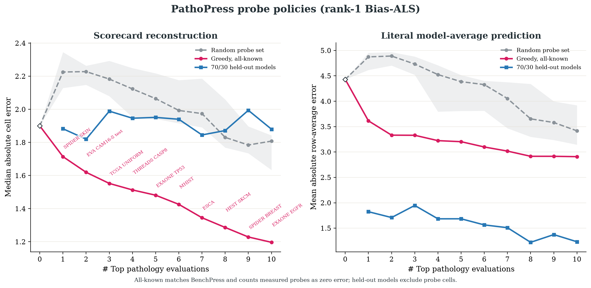
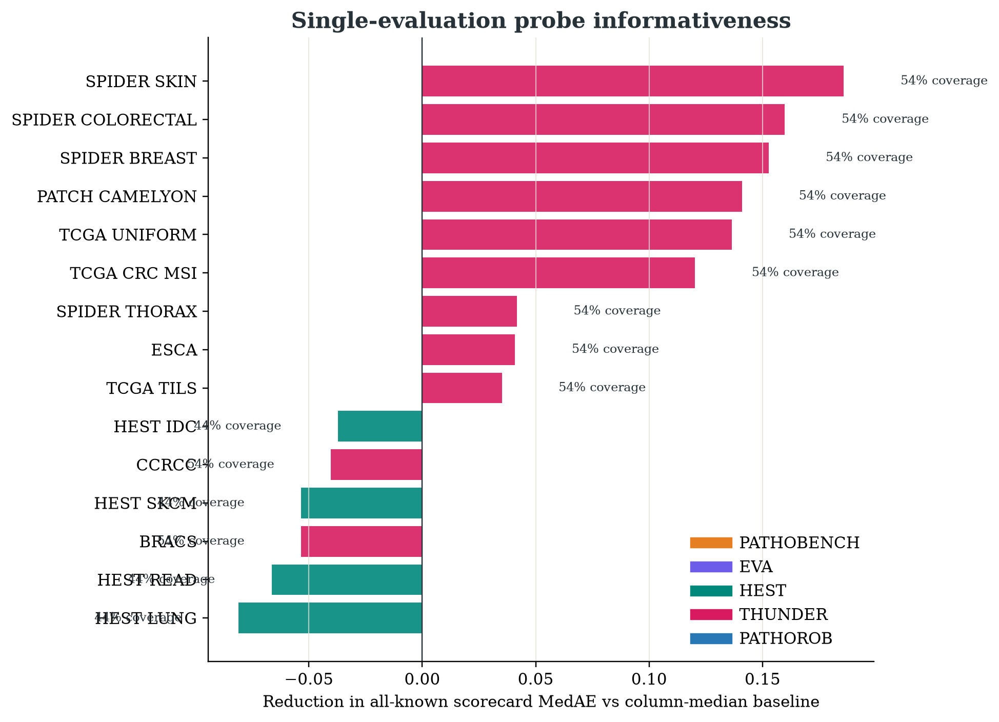

# Imputation and error metrics

## What MAE and MedAE mean

Validation starts with a published cell whose normalized score is known. The
cell is hidden, the remaining matrix is completed, and its prediction is
compared with the hidden score:

```text
absolute error = |imputed normalized score - reported normalized score|
MAE            = arithmetic mean of all absolute errors
MedAE          = median of all absolute errors
```

MAE gives extra weight to occasional large misses. MedAE describes a typical
prediction instance: a MedAE of 1.603026 means half of evaluated imputations
were within 1.603026 normalized points and half were farther away. Neither value is a
confidence interval, clinical error, or universal accuracy percentage.

The common display scale is metric-specific:

| Suite | Source metric | Normalized scale | Meaning of one point |
| --- | --- | --- | --- |
| Patho-Bench | AUC, balanced accuracy, or c-index in 0–1 | `100 × value` | `0.01` source-metric unit |
| Patho-Bench | weighted kappa in −1–1 | `50 × (kappa + 1)` | `0.02` kappa |
| EVA | balanced accuracy or Dice in 0–1 | `100 × value` | `0.01` source-metric unit |
| THUNDER | F1 reported on 0–100 | unchanged | one F1 point |
| HEST | Pearson correlation `r` | `50 × (r + 1)` | `0.02 r` |
| PathoROB | Robustness Index | `100 × RI` | `0.01 RI` |

Pooling these units is useful for fitting a shared matrix, but it does not make
them clinically interchangeable. Suite-specific errors must accompany pooled
errors.

## BenchPress-style validation

The reproduction assigns every observed score within each model to one of
three folds, repeats that assignment for seeds 42 through 51, and predicts the
held-out cells from the remaining scores. Every source cell is therefore tested
once per seed, giving 19,670 rank-1 prediction instances from 1,967 distinct cells.

For the selected rank 1:

| Aggregation | Result |
| --- | ---: |
| Pooled MAE | 3.005264 |
| Pooled MedAE | 1.603026 |
| Median of 30 fold MedAEs | 1.609435 |
| Within 1 point | 35.9532% |
| Within 3 points | 69.6492% |
| Within 5 points | 82.7758% |
| Within 10 points | 94.4331% |

The matching task-column-median baseline has MAE 4.092133 and MedAE 2.477500,
versus rank 1's 3.005264 and 1.603026. This is evidence that the model is using cross-task
structure, although it is not yet a prospective or family-held-out test.

This matches BenchPress's fold construction and reports both pooled and
fold-median aggregation. It does not make the numeric error directly comparable
to BenchPress's language-model matrix because the tasks, score mappings, and
missingness differ.

## Figures

- [Observed/missing matrix](../figures/matrix_observation_pattern.png)
- [Reported versus rank-1 completed matrix](../figures/matrix_completed_rank1.png)
- [Rank sweep, parity plot, suite errors, and error distribution](../figures/benchpress_style_validation_rank1.png)

The parity plot uses only out-of-fold predictions. In the completed heatmap,
reported cells are solid and point estimates are translucent.

## Imputation artifact

[`outputs/imputations_rank1.csv`](../outputs/imputations_rank1.csv) contains one
row for every supported model/evaluation pair. `status=observed` means the score
was reported and is preserved exactly. `status=imputed` marks one of the 7,768
rank-1 point estimates. The file has 1,967 reported rows and includes
source-metric estimates, row/column support counts, a rank-2 comparison, and the
absolute rank-1/rank-2 difference.

The rank difference is a sensitivity diagnostic, not an uncertainty interval.
The ten internal ALS starts stabilize numerical optimization; they are not ten
independent samples. A public prediction service should add calibrated
uncertainty and abstain for weakly supported or out-of-family cells.

Catalog-only tasks with no observed column still cannot be completed because
they have no learned task bias or latent factor. Patho-Bench and EVA now supply
896 and 265 score cells respectively; their exact numerical coverage is
documented in [`score-source-coverage.md`](score-source-coverage.md), including
the 110 EVA alternate-source conflicts retained in
[`data/eva_source_conflicts.csv`](../data/eva_source_conflicts.csv).

## Is the pathology matrix rank 1?

For the final bias-ALS predictor, **one latent interaction factor is preferred**.
On identical matched folds, rank 1 has MAE/MedAE
3.005264/1.603026, versus 3.056250/1.711456 for bias-only rank 0 and
3.117610/1.632035 for rank 2,
and worse errors for every tested rank through 10.

That is not a claim that the raw data matrix has exact algebraic rank 1. The
model is

```text
global mean + model bias + evaluation bias + rank-r interaction
```

so an interaction rank of 1 can have algebraic rank up to roughly 3 in the
transformed score space. Inverse logit and per-column inverse transforms can
raise the algebraic rank again. With incomplete, noisy, heterogeneous data
there is no uniquely observable “true rank”; cross-validation only says that
additional latent interaction dimensions overfit these matched random folds.
The stricter leave-one-suite-block-out experiment prefers rank 5 overall at
4.952972 MAE and 3.055638 MedAE, versus rank 1 at 5.612789/3.525174. That
reversal is a reason to retain rank sensitivity rather than declare a universal
intrinsic rank.

## How exact is the BenchPress reproduction?

For the final logit + z-score + bias-ALS predictor, it is exact on this input
matrix. Running `scripts/verify_benchpress_parity.py` against the pinned
BenchPress checkout compares PathoPress with BenchPress's standalone browser
predictor and currently returns a maximum absolute difference of `0.0` at rank
2. The shared details are ridge `0.1`, 40 ALS iterations, ten initializations
with seeds 42–51, and preservation of observed cells.

The pathology data contract is necessarily adapted: HEST Pearson correlation
is mapped with `50 × (r + 1)`, PathoROB RI with `100 × RI`, and THUNDER F1 is
already on 0–100. All resulting columns satisfy BenchPress's percentage-column
heuristic, so its logit transform is applied exactly. For HEST, that logit is a
scaled Fisher transform after column standardization.

BenchPress's *rank-discovery figure* is a different algorithm from its final
predictor: iterative truncated-SVD Soft-Impute in raw and logit spaces. The
matching pathology reproduction is in
[`soft_impute_rank_sweep_results.json`](../experiments/soft_impute_rank_sweep_results.json)
and [its graph](../figures/soft_impute_rank_sweep.png). Both the raw-space and
logit-space sweeps choose rank 1 on the expanded matrix, agreeing with the
bias-ALS within-model cross-validation result.

## Probe-policy figures



The left panel follows the upstream hero protocol: the magenta greedy curve is
selected and evaluated on the all-known matrix, and exact probe cells remain in
the denominator. The gray curve is the median of 10 nested global random probe
orders with an interquartile band. The blue curve selects probes using 70% of
model rows, then evaluates hidden non-probe cells on each held-out model in
isolation. It is deliberately not joined to the full-matrix zero-probe
baseline, because its model population is different.

The right panel answers the separate literal-average question by averaging the
true and reconstructed values over each model's own fixed published target
cells. Its unit is still a mixture of normalized endpoint scales, so it should
not be interpreted as clinical utility.



This ranking is the first step of greedy selection: lower one-probe scorecard
MedAE means greater conditional predictive utility, and the chart expresses it
as improvement over the 1.900-point full-matrix baseline. Coverage is printed
on every bar because a probe with no published result for a target model
reveals nothing. The final selected trajectories span multiple suites; the
exact ordered probe lists are in the result artifact.

At five and ten probes, all-known scorecard MedAE is 1.481124 and 1.196456;
hidden-only MedAE is 1.612112 and 1.539134. On held-out models, hidden-cell
MedAE is 1.951271 and 1.879857. The literal per-model-average MAE is 3.203489
and 2.908513 for all-known selection, versus 1.684778 and 1.231976 for the
held-out-model evaluation.

Machine-readable results are in
[`experiments/probe_selection_results_rank1.json`](../experiments/probe_selection_results_rank1.json)
and [`outputs/probe_informativeness_rank1.csv`](../outputs/probe_informativeness_rank1.csv).
The exact protocol and its limitations are documented in
[`benchpress-parity.md`](benchpress-parity.md).
