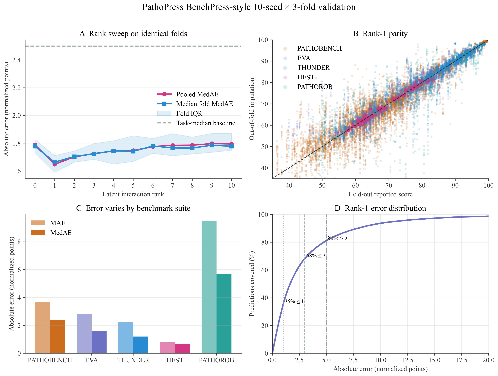
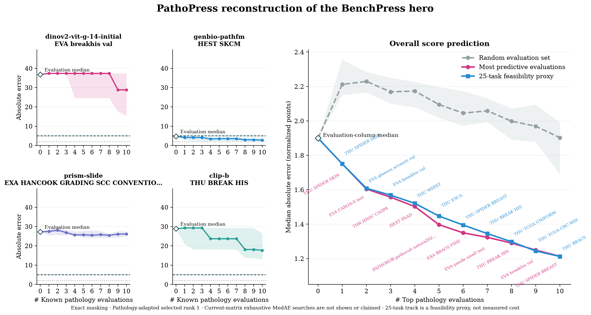
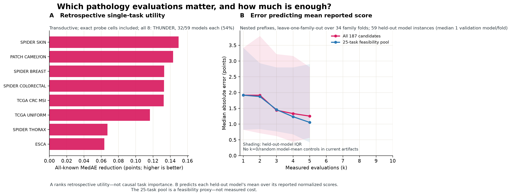
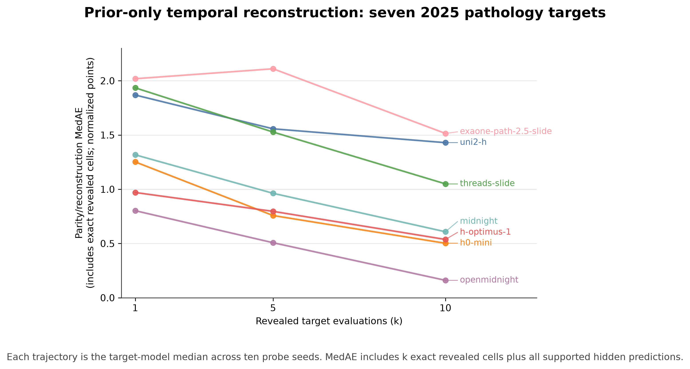

# Generated figure gallery

The public gallery contains exactly four result figures. PNG files are review assets;
matching PDFs are publication/vector assets. Plotters consume committed JSON/CSV results and
do not rerun the expensive experiments.

The fixed research matrix is 59 models × 187 protocol-level evaluations with 2,122 observed
cells (19.2332% density).

| # | Figure | Source artifact |
|---|---|---|
| 1 | [Cell-level rank validation](#1-cell-level-rank-validation) | [`benchpress_style_results.json`](../experiments/benchpress_style_results.json) |
| 2 | [BenchPress-style pathology hero](#2-benchpress-style-pathology-hero) | [`benchpress_style_hero_summary.json`](../experiments/benchpress_style_hero_summary.json) |
| 3 | [Task utility and held-out mean prediction](#3-task-utility-and-held-out-mean-prediction) | [`probe_dual_objective_rank1.csv`](../outputs/probe_dual_objective_rank1.csv) |
| 4 | [Temporal deployment](#4-temporal-deployment) | [`temporal_deployment_rank1.json`](../experiments/temporal_deployment_rank1.json) |

---

### 1. Cell-level rank validation

<p align="center">
  
</p>

**Shows.** Rank sweep over 2,122 unique reported cells and 21,181 repeated held-out
prediction instances from ten seeds × three folds.

**Scope caveat.** Other scores from the same model may remain visible; this is not
model-level holdout.

### 2. BenchPress-style pathology hero

<p align="center">
  
</p>

**Shows.** Retrospective all-known cell reconstruction.

**Scope caveat.** Revealed probes are exact, and selection/evaluation use the same model
population, so this is not a held-out comparison; for the matched-cell held-out numbers see
[`lofo_matched_cells_rank1.json`](../experiments/lofo_matched_cells_rank1.json). Probes are
also selected on an objective that scores revealed cells as 0.0 and is about 15.9% optimistic
at four probes. The 25-task track is a low-friction proxy, not measured cost.

### 3. Task utility and held-out mean prediction

<p align="center">
  
</p>

**Shows.** Panel A is transductive single-task utility. Panel B follows a leave-one-family-out
protocol over 34 family folds, with nested prefixes selected per fold: all 59 models are held
out exactly once, at a median of 1 validation model per fold (min 1, max 7) against 58
training models, and the target is the mean reported normalized score of the held-out
model(s). Revealed probe values are exact and supported hidden cells are predicted.

**Scope caveat.** Panel A is not causal task importance, and must not be read as evidence that
probe selection helps a given evaluation: on the corrected held-out measurement,
per-evaluation utility is null (86 of 174 scored columns, 49.4%, CI [42.0%, 56.9%] — see
[`lofo_matched_cells_rank1.json`](../experiments/lofo_matched_cells_rank1.json)). No held-out
`k=0` or random model-mean control is available for the mean-prediction panel.

### 4. Temporal deployment

<p align="center">
  
</p>

**Shows.** Seven 2025 target models trained from strictly prior releases.

**Scope caveat.** Each trajectory is the target-level median over ten probe seeds; MedAE
includes `k` exact revealed cells plus supported hidden predictions.

---

The interaction rank is a fitted completion hyperparameter, not the literal rank of the
pathology data. The ranking, confidence, Soft-Impute, and cost audits remain available as
machine-readable experiment artifacts without additional public charts. In particular, the
cost registry reports no measured runtime/dollar curve; sample count and the 25-task proxy are
not cost models.

## Regeneration

Install the research dependencies, then run only these lightweight plotters:

```bash
python3 -m pip install -e '.[research]'
python3 scripts/plot_benchpress_style.py
python3 scripts/plot_benchpress_style_hero.py
python3 scripts/plot_probe_dual_objective.py
python3 scripts/plot_temporal_deployment.py
```

The experiment runners and local-cache boundaries are documented in the
[experiment index](../experiments/README.md).
